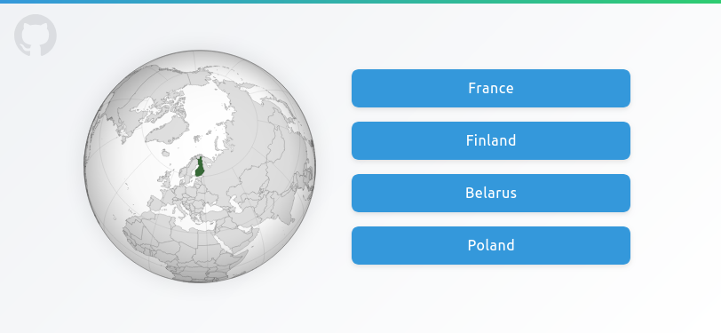

# Jorden

A geography quiz game where you're shown a map of a country and guess which country it is. Test your geography knowledge and have fun learning about countries around the world!

## Live Demo

The game is available online at [jorden.simonolander.org](https://jorden.simonolander.org).

<a href="https://jorden.simonolander.org"></a>

## Getting Started

### Prerequisites

- Node.js (version 22 or higher recommended)
- npm (comes with Node.js)

### Installation

1. Clone the repository:
   ```bash
   git clone https://github.com/simonolander/jorden.git
   cd jorden
   ```

2. Install dependencies:
   ```bash
   npm install
   ```

3. Run the development server:
   ```bash
   npm run dev
   ```

4. Open [http://localhost:3000](http://localhost:3000) with your browser to see the result.

## Build

To build the application for production:

```bash
npm run build
```

You will find the artefacts in [out](out).

## Release

New versions are released automatically every commit to master.

## Map Credits

The maps used in this project are sourced from:

- [Wikimedia Commons Grey-green orthographic projections maps](https://commons.wikimedia.org/wiki/Grey%E2%80%93green_orthographic_projections_maps)
- [Observable HQ Draggable SVG World Map](https://observablehq.com/@mikima/draggable-svg-world-map)

Each map is credited to its individual author as specified in the Wikimedia Commons pages. The full list of authors can be found in the project's `src/app/countries.json` file.
